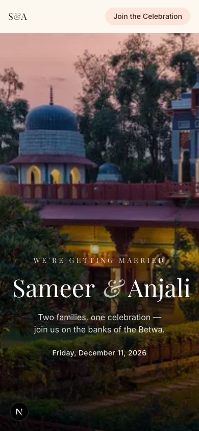
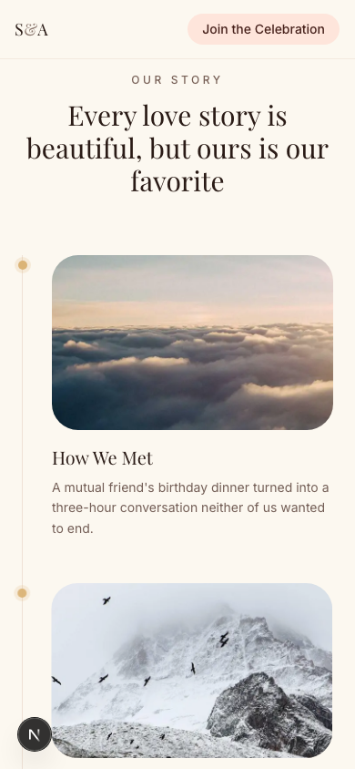
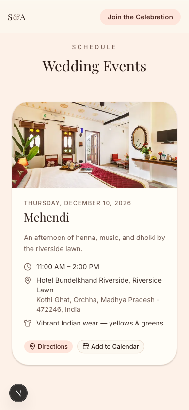
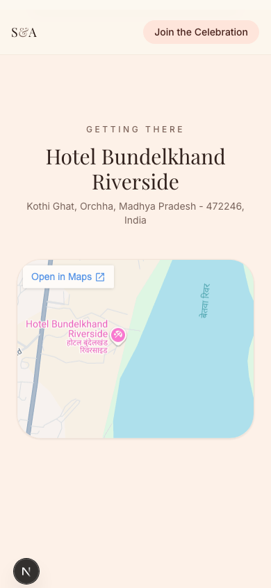
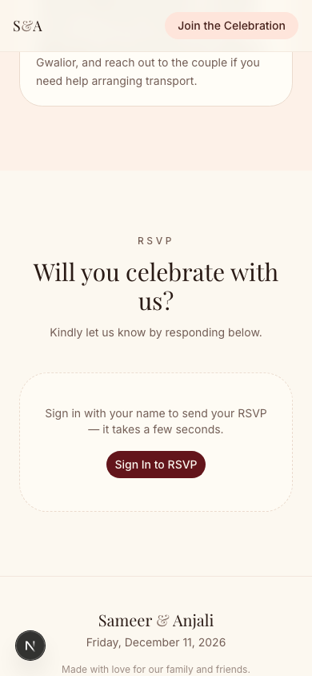
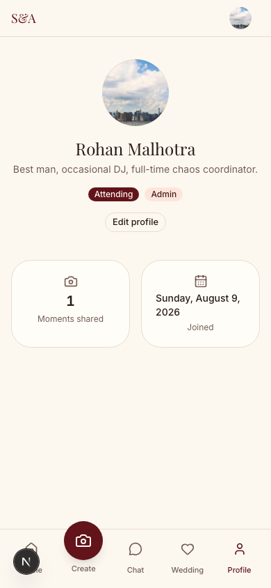
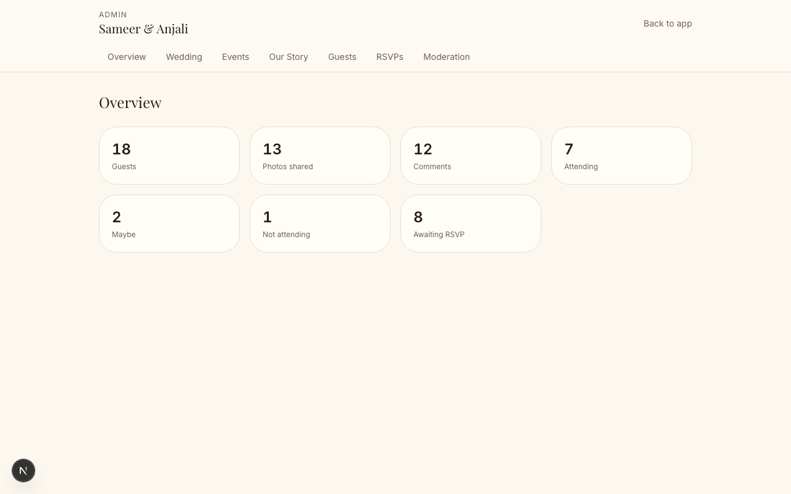
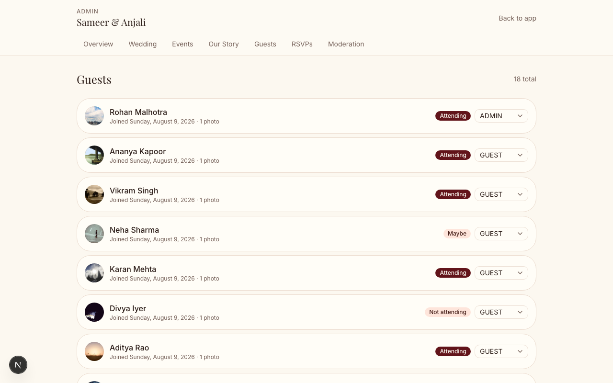

# WedSnap — Wedding Invitation & Guest Social App

A mobile-first wedding invitation site paired with a private, authenticated social space where guests share photos, follow ephemeral "Wedding Moments" stories, and chat — one Next.js app, two experiences.

Configured for Sameer & Anjali's wedding (Dec 10–11, 2026, Hotel Bundelkhand Riverside, Orchha) — swap the seed data and `WEDDING_SLUG` for a different couple/venue at any time; nothing else in the app hardcodes wedding content.

## Screenshots

<table>
  <tr>
    <td></td>
    <td></td>
    <td></td>
  </tr>
  <tr>
    <td></td>
    <td></td>
    <td></td>
  </tr>
</table>

<p>
  
</p>
<p>
  
</p>

_Guest feed, stories, and chat screenshots are intentionally left out here since the dev/staging instance already has real guests' photos and messages in it — see the app live instead._

## What's inside

- **Public invitation** (`/`) — hero, timezone-aware countdown, "Our Story" timeline, event schedule with directions/calendar links, venue map, RSVP.
- **Guest app** (`/app`, sign-in required) — Wedding Moments stories (24h, full-screen swipe/tap viewer), photo feed with cursor-paginated infinite scroll, reactions & comments, camera capture/gallery upload, editable profile, and a realtime group chat.
- **Admin dashboard** (`/admin`, admin role required) — edit wedding/venue details, manage events and the "Our Story" timeline, guest list & roles, RSVP responses, and post/comment moderation.

## Tech stack

- **Next.js 16** (App Router, Turbopack, Server Components by default)
- **TypeScript**, **Tailwind CSS v4**, **shadcn/ui** (Base UI primitives, not Radix)
- **Clerk** — authentication (no passwords handled by this app)
- **Prisma 7** + **Neon Postgres**, via the standard `pg` driver adapter
- **Cloudinary** — private, signed media storage for guest photos
- **Pusher** — realtime chat (pub/sub, no client polling)
- **Zod** — input validation on every server action / route handler
- **Framer Motion** — animations (respects `prefers-reduced-motion`)

## Project structure

```
src/
  app/
    (public)/        the invitation site — app/(public)/page.tsx renders "/"
    (auth)/          Clerk sign-in / sign-up pages
    app/             authenticated guest experience ("/app/...")
    admin/           admin dashboard ("/admin/...")
    api/             route handlers: feed & chat pagination, Pusher/Clerk webhooks
  components/
    invitation/      public site sections (Hero, EventCard, RsvpForm, ...)
    social/          feed, stories, camera, profile, comments
    chat/            chat room + message bubble
    admin/           admin forms & table controls
    layout/          bottom nav (mobile) / sidebar (desktop) app shell
    motion/          shared scroll-reveal animation wrapper
    ui/              shadcn/ui primitives
  lib/
    auth/            Clerk <-> Prisma user/guest sync + authorization helpers
    db/               Prisma client singleton (pooled, serverless-safe)
    storage/          Cloudinary signed-upload abstraction
    realtime/         Pusher channel/event naming + client/server helpers
    validation/       Zod schemas
    data/             read-side data-fetching helpers (feed, stories, chat, admin)
    actions/          shared server actions (reactions, comments, chat, media)
    utils/            date/timezone + calendar-link formatting
  proxy.ts            Clerk route-protection middleware
prisma/
  schema.prisma
  seed.ts
```

## Prerequisites

- Node.js 20+
- Free-tier accounts for:
  - [Neon](https://neon.tech) — Postgres (or skip this for local dev, see below)
  - [Clerk](https://clerk.com) — authentication
  - [Cloudinary](https://cloudinary.com) — media storage
  - [Pusher](https://pusher.com) — a "Channels" app for realtime chat

## Getting started

### 1. Install dependencies

```bash
npm install
```

### 2. Configure environment variables

```bash
cp .env.example .env
```

Fill in `.env` — `.env.example` has a comment above each variable saying exactly where to find it (Clerk/Cloudinary/Pusher/Neon dashboards).

**No Neon account yet?** Run a local Postgres instead with Prisma's own tooling:

```bash
npx prisma dev
```

It prints a connection string — use it for both `DATABASE_URL` and `DIRECT_URL` in `.env`.

### 3. Set up the database

```bash
npm run db:migrate
npm run db:seed
```

This applies the schema and seeds one sample wedding — couple info, 5 events, an "Our Story" timeline, ~16 guests, posts/comments/reactions, a populated group chat, and RSVPs — under the slug set in `WEDDING_SLUG`.

### 4. Run it

```bash
npm run dev
```

Open [http://localhost:3000](http://localhost:3000).

### 5. Sign in, and (optionally) become an admin

Sign in with any email — Clerk handles verification, and the first sign-in auto-creates your guest profile and drops you into the group chat. To get admin access, add your Clerk user ID to `ADMIN_CLERK_IDS` in `.env` (comma-separated) before signing in, or have an existing admin promote you from `/admin/guests` afterward. Find your Clerk user ID in the Clerk dashboard's **Users** list.

### Testing on a real phone

Next.js only serves the dev server to `localhost` by default. To open it on a phone on the same WiFi:

- **Quick**: add your computer's LAN IP (e.g. `192.168.1.33`) to `allowedDevOrigins` in `next.config.ts` and restart `npm run dev`.
- **More reliable, especially for Clerk sign-in**: tunnel with `ngrok http 3000`, then add the printed `*.ngrok-free.dev` hostname to `allowedDevOrigins` instead. Clerk's session handling expects a stable, real HTTPS origin — a raw LAN IP over HTTP can cause sign-in redirect loops.

## Available scripts

| Script                | Description                            |
| ---------------------- | --------------------------------------- |
| `npm run dev`          | Start the dev server (Turbopack)        |
| `npm run build`        | Production build                        |
| `npm run start`        | Start the production build              |
| `npm run lint`         | ESLint                                  |
| `npm run db:generate`  | Regenerate the Prisma client            |
| `npm run db:migrate`   | Create/apply a migration (dev)          |
| `npm run db:deploy`    | Apply migrations (production)           |
| `npm run db:studio`    | Open Prisma Studio                      |
| `npm run db:seed`      | Run `prisma/seed.ts`                    |

## Architecture notes

- **Server Components by default.** The public invitation is statically rendered with 5-minute ISR; only interactive islands (auth-aware CTAs, the RSVP form, camera, chat) are Client Components — the goal is minimal JavaScript on the pages every guest hits first.
- **Media privacy.** Guest photos upload directly from the browser to Cloudinary via a short-lived signed URL (`lib/storage/upload.ts`) and are stored with Cloudinary's `authenticated` delivery type. A display URL is re-signed server-side, per request, only after confirming the viewer belongs to the wedding (`lib/storage/getSignedUrl.ts`) — a raw, reusable photo URL is never persisted or exposed. Profile avatars intentionally use public delivery instead, since they're identity images shown throughout the app rather than private wedding content.
- **Realtime chat.** Pusher Channels, authorized per subscription against `ChatMember` (`app/api/pusher/auth/route.ts`), so a guest can only subscribe to rooms they actually belong to. No client polls the database for new messages.
- **Cursor pagination everywhere it matters.** The feed (`/api/posts`) and chat history (`/api/chat/[roomId]/messages`) both paginate by cursor rather than offset, so results stay correct under concurrent writes at ~400–500 guest scale.
- **Multi-wedding-ready schema, single-wedding deployment.** Every guest-facing model hangs off a `Wedding` row; this deployment serves exactly one (`WEDDING_SLUG` env var), but nothing in the schema prevents hosting more later.
- **Authorization is server-side, always.** Every server action and route handler re-checks the caller's identity, wedding membership, and (for admin routes) role via `requireGuest`/`requireAdmin` (`lib/auth/current-guest.ts`) — a hidden button is never treated as a security boundary.

## Deploying

1. Apply the schema to your production database: `npm run db:deploy` (uses `DIRECT_URL`).
2. Deploy to Vercel (or similar), setting every variable from `.env.example` in the platform's environment settings.
3. In the Clerk dashboard, add a webhook at `https://<your-domain>/api/webhooks/clerk` subscribed to `user.created`, `user.updated`, and `user.deleted`, then put its signing secret in `CLERK_WEBHOOK_SIGNING_SECRET`.
4. Update `NEXT_PUBLIC_APP_URL` to your production URL.
5. Swap `WEDDING_SLUG` and re-run the seed (or use `/admin`) with your real wedding's details.
